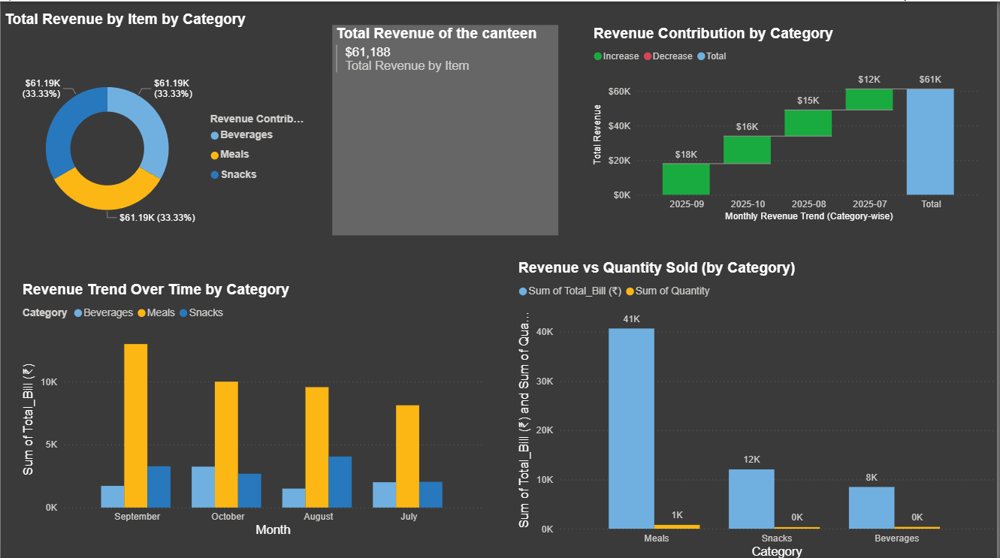

# Canteen Sales & Revenue Analytics

An interactive Power BI dashboard for analyzing canteen sales, revenue, item performance, and time-based trends.

## Dashboard

The project contains five analytical views:

### 1. Sales & Revenue

Overview of sales and revenue performance.


### 2. Categorisation

Analysis of sales across different categories.



### 3. Item-wise Sales Quantity & Revenue

Comparison of item-level sales quantity and revenue.


### 4. Item Details

Detailed view of individual item performance.


### 5. Date-wise Report

Analysis of sales and revenue across different dates.


## Data

The dashboard uses Excel-based source datasets containing customer billing and item details.

## Tools & Technologies

- Power BI
- Power Query
- DAX
- Data Modeling
- Microsoft Excel

## Project Structure

```text
Canteen-Sales-PowerBI/
├── README.md
├── Canteen_dashboard.pbix
├── Data/
└── Screenshots/
